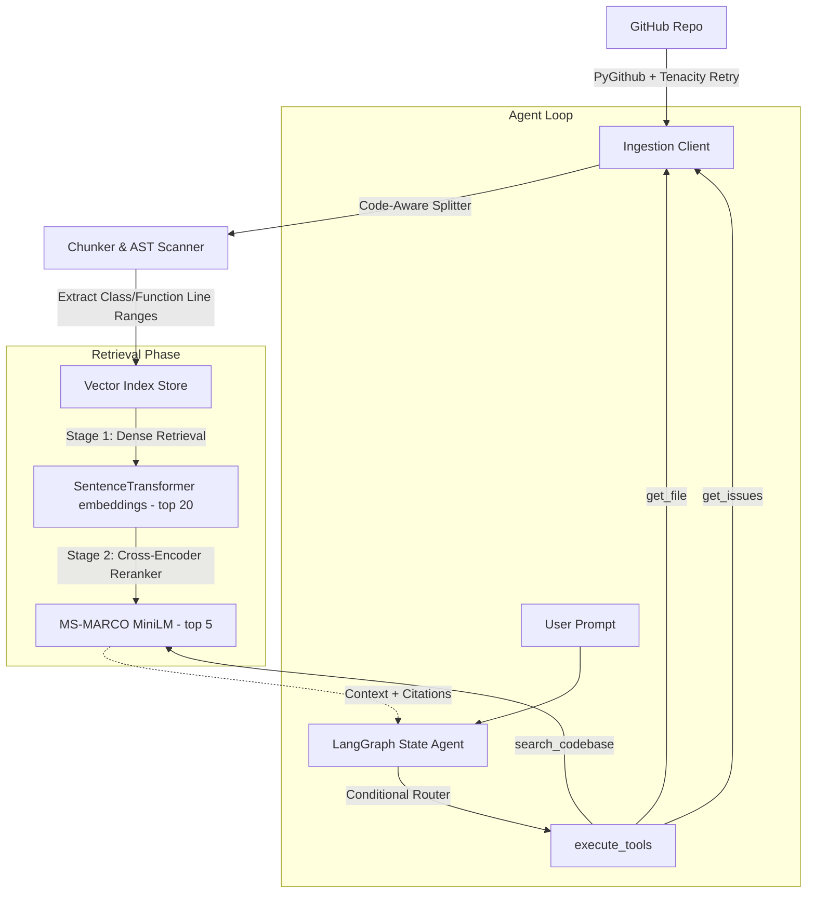

# 🤖 Autonomous Coding Assistant

An enterprise-grade, stateful AI agent that ingests GitHub repositories, constructs code-aware semantic indexes with local SentenceTransformer embeddings, performs two-stage cross-encoder reranking, and orchestrates reasoning over multiple tools via a stateful **LangGraph** workflow.

This project goes beyond simple PDF/document Q&A. It is engineered specifically to understand **code syntax boundaries, AST structures, line scopes, and open GitHub issues** to serve as a fully autonomous development peer.

---

## 🛠 Tech Stack & Architecture



### Core Technologies
*   **Agentic Orchestration:** `LangGraph` for stateful multi-step reasoning, conditional tool loops, and human-in-the-loop readiness.
*   **Vector Engine:** `ChromaDB` (persistent local metadata-aware collection per repository).
*   **Dense Embeddings:** Local `all-MiniLM-L6-v2` via `sentence-transformers` (zero cost, low latency, runs completely on device).
*   **Re-ranking Engine:** Local Cross-Encoder `cross-encoder/ms-marco-MiniLM-L-6-v2` (crucial for overcoming token limits and matching complex structural logic).
*   **GitHub Connector:** `PyGithub` wrapped in a custom recursive tree walker with jittered exponential backoff retries via `tenacity`.
*   **API Layer:** `FastAPI` (async endpoints, background tasks, and structured payloads).
*   **CLI & Styling:** `Typer` and `Rich` for professional, highlighted CLI outputs and interactive shell experiences.

---

## 🚀 Key Senior Engineering Highlights

### 1. Code-Aware Chunking & Line Range Mapping
Naive text-splitters split python classes or functions right in the middle of standard tokens. This system uses `RecursiveCharacterTextSplitter.from_language` to break only at syntax boundaries. 
Additionally, we implement **character-to-line character offsets** mapping. The chunker counts character spans, matches them against the original text, and calculates precise 1-based start and end lines.
It then **scans upwards** from the beginning of a chunk to extract the active, enclosing class and function context:
*   *For Python:* Detects `def <func>` or `class <class>` definitions considering local indentation scopes.
*   *For JS/TS:* Parses ES6 arrow functions, object methods, and classes.
*   *Resulting Metadata:* `file_path`, `start_line`, `end_line`, `function_name`, `class_name`. This enables high-fidelity citations.

### 2. Two-Stage Retrieval with Cross-Encoder Reranker
Cosine similarity over dense embeddings often fails at retrieving complex code relations because it ignores sequential logic. 
To solve this, we implement a **two-stage retrieval pipeline**:
1.  **First Stage (Dense Retrieval):** Fetches the top `K=20` candidate chunks using fast local vector similarity.
2.  **Second Stage (Reranking):** Scores all 20 candidate chunks against the user query using a high-fidelity **Cross-Encoder Model** (`ms-marco-MiniLM-L-6-v2`). This model performs full attention over the query-code pair, sorting by deep semantic relevance. We then keep only the top `N=5` chunks.

### 3. Production-Grade Rate Limit and Backoff Architecture
GitHub's API enforces strict rate limits. A simple raw call can trigger a `403` or `429` error and abort ingestion. We use `tenacity` retry loops with exponential backoff and randomized jitter:
```python
@retry(
    retry=retry_if_exception_type(GithubException),
    stop=stop_after_attempt(5),
    wait=wait_exponential(multiplier=1, min=2, max=30),
    reraise=True
)
```
This guarantees the ingestion tool behaves like a production-grade system and recovers seamlessly.

---

## ⚡ CLI and API Quick Start

### Installation & Environment Setup
Using `uv` (modern, ultra-fast Python package manager) is recommended:
```bash
# Clone the repository
git clone https://github.com/your-username/ai-code-assistant-agent.git
cd ai-code-assistant-agent

# Install dependencies into virtual environment
uv venv
source .venv/bin/activate
uv pip install -e .
```

Create a `.env` file with your credentials:
```env
GROQ_API_KEY=gsk_your_groq_api_key
GITHUB_TOKEN=ghp_your_github_token
GITHUB_POST_COMMENTS=false
```

---

### 🖥️ CLI Usage

#### Step 1: Ingest a Repository
Run ingestion over a repository (filters by `.py`, `.js`, `.ts`, `.md` by default):
```bash
python ingest.py --repo tiangolo/fastapi
```

#### Step 2: Codebase Q&A Mode
Query the assistant about the architecture, workflows, or specific files:
```bash
python assistant.py --repo tiangolo/fastapi "How does the dependency injection system resolve parameters?"
```

#### Step 3: Issue Fix Suggestions Mode
Point the assistant to an open GitHub issue. It will retrieve relevant code files, discover the root cause, output a unified git diff, explain it, and formulate a test case:
```bash
python assistant.py --repo tiangolo/fastapi --mode issue --issue-number 9553
```

---

### 🌐 FastAPI Server Endpoints

Start the API server:
```bash
uvicorn src.api.main:app --reload --host 0.0.0.0 --port 8000
```

#### Key API Endpoints
*   `POST /ingest` — Starts async background repository ingestion.
*   `GET /ingest/status/{owner}/{repo}` — Checks status of ingestion task.
*   `GET /repos` — Lists all currently ingested code databases.
*   `POST /query` — Query the LangGraph RAG Agent with a list of chat history messages.
*   `POST /analyze-issue` — Run autonomous bug-fixing pipeline and output structured JSON matching the `IssueFix` schema.

---

## 🐳 Docker Deployment

You can build and deploy the entire server along with persistent ChromaDB storage in seconds:
```bash
docker-compose up --build -d
```
Chroma database indexes will persist in a named Docker volume `chroma_data`.

---

## 💎 What Hirers Look For: Interview Talking Points

If you showcase this project in an interview, be prepared to talk about these advanced decisions:

*   **Why local embeddings?**
    > *"We selected sentence-transformers `all-MiniLM-L6-v2` to avoid external API dependencies, keep data private, and maintain millisecond latency. It runs fully locally on consumer CPUs."*
*   **What is the benefit of the Cross-Encoder Reranker?**
    > *"Bi-encoders produce separate embeddings for query and document. While very fast, they ignore interaction details. A Cross-Encoder performs joint self-attention over the query and code text simultaneously. Applying a two-stage process (Retrieving top 20 with Bi-encoder, Reranking to top 5 with Cross-Encoder) gives us the best of both worlds: extreme speed and superior relevance."*
*   **How does the LangGraph Agent compare to simple LangChain chains?**
    > *"Standard chains are hardcoded pipelines. Our LangGraph agent uses tool-calling models that choose their own actions dynamically. For a query like 'Why is JWT failing?', the agent can choose to first search the codebase, then use `get_file` to fetch the full JWT middleware, and then fetch related open issues. This non-linear, adaptive behavior is how production developer agents work."*
